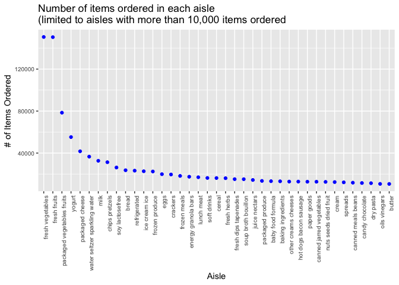

p8105\_hw3\_blm2156
================
Britney Mazzetta - blm2156

# Problem 1

``` r
library(tidyverse)
```

    ## ── Attaching packages ────────────────────────────────────────── tidyverse 1.2.1 ──

    ## ✔ ggplot2 3.2.1     ✔ purrr   0.3.2
    ## ✔ tibble  2.1.3     ✔ dplyr   0.8.3
    ## ✔ tidyr   1.0.0     ✔ stringr 1.4.0
    ## ✔ readr   1.3.1     ✔ forcats 0.4.0

    ## ── Conflicts ───────────────────────────────────────────── tidyverse_conflicts() ──
    ## ✖ dplyr::filter() masks stats::filter()
    ## ✖ dplyr::lag()    masks stats::lag()

``` r
library(p8105.datasets)
library(knitr)
data("instacart")
```

## Description of Dataset

There are 1384617 rows in the instacart dataset. There are 15 columns in
the instacart dataset.

There are 134 distinct aisles in the dataset.

## \# of Aisles and Most Popular Aisle

``` r
aisle_info = instacart %>% 
  group_by(aisle_id, aisle) %>%
  summarize(n=n()) %>%
  arrange(desc(n))
```

The aisle in which the most items were ordered from is aisle 83 (fresh
vegetables), with 150609 orders. The aisle in which the second most
items were ordered from is aisle 24 (fresh fruits), with 150473 orders.
The aisle in which the third most items were ordered from is aisle 123
(packaged vegetables fruits), with 78493 orders.

## Instacart Plot

``` r
instacart_plot = filter(aisle_info, n >10000)
ggplot(
  instacart_plot, 
  aes(x = reorder(aisle, -n), y =n)) + 
  geom_point(color = 'blue') +
  theme(axis.text.x = element_text(angle = 90, hjust = 1),
        axis.text = element_text(size = 7.5)) +
  ggtitle("Number of items ordered in each aisle \n(limited to aisles with more than 10,000 items ordered") +
labs(y = "# of Items Ordered",
     x = "Aisle")
```

<!-- -->

## 3 Most popular items in each aisle

``` r
library(knitr)

ranking = instacart %>%
filter(aisle == "baking ingredients" | aisle == "dog food care" | aisle == "packaged vegetables fruits") %>%
  group_by(aisle, product_name)%>%
  summarise(n = n()) %>%
  mutate(product_ranking = min_rank(desc(n))) %>% 
  filter(product_ranking < 4) %>%
  knitr::kable()
  ranking
```

| aisle                      | product\_name                                 |    n | product\_ranking |
| :------------------------- | :-------------------------------------------- | ---: | ---------------: |
| baking ingredients         | Cane Sugar                                    |  336 |                3 |
| baking ingredients         | Light Brown Sugar                             |  499 |                1 |
| baking ingredients         | Pure Baking Soda                              |  387 |                2 |
| dog food care              | Organix Chicken & Brown Rice Recipe           |   28 |                2 |
| dog food care              | Small Dog Biscuits                            |   26 |                3 |
| dog food care              | Snack Sticks Chicken & Rice Recipe Dog Treats |   30 |                1 |
| packaged vegetables fruits | Organic Baby Spinach                          | 9784 |                1 |
| packaged vegetables fruits | Organic Blueberries                           | 4966 |                3 |
| packaged vegetables fruits | Organic Raspberries                           | 5546 |                2 |
