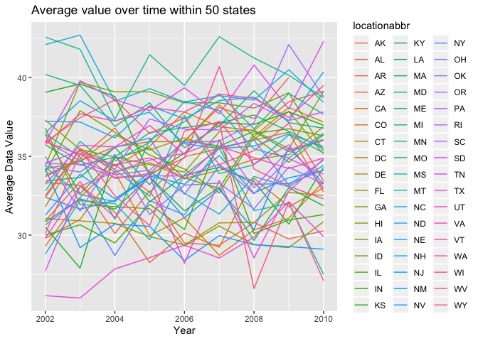
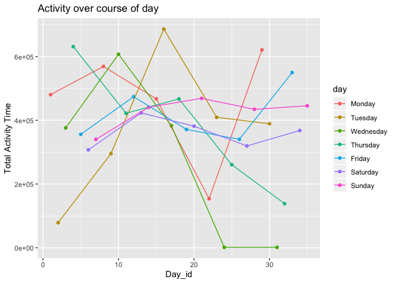

p8105\_hw3\_blm2156
================
Britney Mazzetta - blm2156

# Problem 1

``` r
library(tidyverse)
```

    ## ── Attaching packages ───────────────────────────────────────── tidyverse 1.2.1 ──

    ## ✔ ggplot2 3.2.1     ✔ purrr   0.3.2
    ## ✔ tibble  2.1.3     ✔ dplyr   0.8.3
    ## ✔ tidyr   1.0.0     ✔ stringr 1.4.0
    ## ✔ readr   1.3.1     ✔ forcats 0.4.0

    ## ── Conflicts ──────────────────────────────────────────── tidyverse_conflicts() ──
    ## ✖ dplyr::filter() masks stats::filter()
    ## ✖ dplyr::lag()    masks stats::lag()

``` r
library(p8105.datasets)
library(knitr)
data("instacart")
```

## Description of Dataset

There are 1384617 rows in the instacart dataset. There are 15 columns in
the instacart dataset.

There are 134 distinct aisles in the dataset.

## Number of Aisles and Most Popular Aisle

``` r
aisle_info = instacart %>% 
  group_by(aisle_id, aisle) %>%
  summarize(n=n()) %>%
  arrange(desc(n))
```

The aisle in which the most items were ordered from is aisle 83 (fresh
vegetables), with 150609 orders. The aisle in which the second most
items were ordered from is aisle 24 (fresh fruits), with 150473 orders.
The aisle in which the third most items were ordered from is aisle 123
(packaged vegetables fruits), with 78493 orders.

## Instacart Plot

``` r
instacart_plot = filter(aisle_info, n >10000)
ggplot(
  instacart_plot, 
  aes(x = reorder(aisle, -n), y =n)) + 
  geom_point(color = 'blue') +
  theme(axis.text.x = element_text(angle = 90, hjust = 1),
        axis.text = element_text(size = 7.5)) +
  ggtitle("Number of items ordered in each aisle \n(limited to aisles with more than 10,000 items ordered") +
labs(y = "# of Items Ordered",
     x = "Aisle")
```

<!-- -->

## 3 Most popular items in each aisle

``` r
library(knitr)

ranking = instacart %>%
filter(aisle == "baking ingredients" | aisle == "dog food care" | aisle == "packaged vegetables fruits") %>%
  group_by(aisle, product_name)%>%
  summarise(n = n()) %>%
  mutate(product_ranking = min_rank(desc(n))) %>% 
  filter(product_ranking < 4) %>%
  knitr::kable()
  ranking
```

| aisle                      | product\_name                                 |    n | product\_ranking |
| :------------------------- | :-------------------------------------------- | ---: | ---------------: |
| baking ingredients         | Cane Sugar                                    |  336 |                3 |
| baking ingredients         | Light Brown Sugar                             |  499 |                1 |
| baking ingredients         | Pure Baking Soda                              |  387 |                2 |
| dog food care              | Organix Chicken & Brown Rice Recipe           |   28 |                2 |
| dog food care              | Small Dog Biscuits                            |   26 |                3 |
| dog food care              | Snack Sticks Chicken & Rice Recipe Dog Treats |   30 |                1 |
| packaged vegetables fruits | Organic Baby Spinach                          | 9784 |                1 |
| packaged vegetables fruits | Organic Blueberries                           | 4966 |                3 |
| packaged vegetables fruits | Organic Raspberries                           | 5546 |                2 |

## Mean hour of the day at which Pink Lady Apples and Coffee Ice Cream are ordered on each day of the week

``` r
mean_hour_apples_icecream=instacart %>%
  filter(product_name == "Pink Lady Apples" | 
      product_name == "Coffee Ice Cream") %>%
  group_by(product_name, order_dow) %>%
  summarize(mean_order_hour= mean(order_hour_of_day)) %>%
  select(product_name, order_dow, mean_order_hour) %>%
  pivot_wider(
      names_from = order_dow,
      values_from = mean_order_hour
  ) %>%
  knitr::kable ()
mean_hour_apples_icecream
```

| product\_name    |        0 |        1 |        2 |        3 |        4 |        5 |        6 |
| :--------------- | -------: | -------: | -------: | -------: | -------: | -------: | -------: |
| Coffee Ice Cream | 13.77419 | 14.31579 | 15.38095 | 15.31818 | 15.21739 | 12.26316 | 13.83333 |
| Pink Lady Apples | 13.44118 | 11.36000 | 11.70213 | 14.25000 | 11.55172 | 12.78431 | 11.93750 |

# Problem 2

``` r
data("brfss_smart2010")
```

## Data cleaning

``` r
brfss = brfss_smart2010 %>%
  janitor::clean_names() %>%
  filter(topic == "Overall Health" |
           response == "Excellent" |
           response == "Very good" |
           response == "Good" |
           response == "Fair" |
           response == "Poor") %>%
mutate(response = factor(response, labels = c("Poor","Fair","Good","Very good", "Excellent" ))) %>%
select(-location_id, -data_value_footnote_symbol, -data_value_footnote)
brfss
```

    ## # A tibble: 10,625 x 20
    ##     year locationabbr locationdesc class topic question response
    ##    <int> <chr>        <chr>        <chr> <chr> <chr>    <fct>   
    ##  1  2010 AL           AL - Jeffer… Heal… Over… How is … Poor    
    ##  2  2010 AL           AL - Jeffer… Heal… Over… How is … Excelle…
    ##  3  2010 AL           AL - Jeffer… Heal… Over… How is … Good    
    ##  4  2010 AL           AL - Jeffer… Heal… Over… How is … Fair    
    ##  5  2010 AL           AL - Jeffer… Heal… Over… How is … Very go…
    ##  6  2010 AL           AL - Mobile… Heal… Over… How is … Poor    
    ##  7  2010 AL           AL - Mobile… Heal… Over… How is … Excelle…
    ##  8  2010 AL           AL - Mobile… Heal… Over… How is … Good    
    ##  9  2010 AL           AL - Mobile… Heal… Over… How is … Fair    
    ## 10  2010 AL           AL - Mobile… Heal… Over… How is … Very go…
    ## # … with 10,615 more rows, and 13 more variables: sample_size <int>,
    ## #   data_value <dbl>, confidence_limit_low <dbl>,
    ## #   confidence_limit_high <dbl>, display_order <int>,
    ## #   data_value_unit <chr>, data_value_type <chr>, data_source <chr>,
    ## #   class_id <chr>, topic_id <chr>, question_id <chr>, respid <chr>,
    ## #   geo_location <chr>

## In 2002, which states were observed at 7 or more locations? What about in 2010?

``` r
brfss %>%
  filter(year == "2002") %>%
  group_by(locationabbr) %>%
  summarize(
    number_observations = n_distinct(geo_location)) %>%
    filter(number_observations > 6) %>%
  arrange(desc(number_observations))
```

    ## # A tibble: 6 x 2
    ##   locationabbr number_observations
    ##   <chr>                      <int>
    ## 1 PA                            10
    ## 2 MA                             8
    ## 3 NJ                             8
    ## 4 CT                             7
    ## 5 FL                             7
    ## 6 NC                             7

PA, MA, NJ, CT, FL, and NC each were observed at 7 or more locations.

In 2002, which states were observed at 7 or more locations? What about
in 2010?

``` r
brfss %>%
  filter(year == "2010") %>%
  group_by(locationabbr) %>%
  summarize(
    number_observations = n_distinct(geo_location)) %>%
    filter(number_observations > 6) %>%
  arrange(desc(number_observations))
```

    ## # A tibble: 14 x 2
    ##    locationabbr number_observations
    ##    <chr>                      <int>
    ##  1 FL                            41
    ##  2 NJ                            19
    ##  3 TX                            16
    ##  4 CA                            12
    ##  5 MD                            12
    ##  6 NC                            12
    ##  7 NE                            10
    ##  8 WA                            10
    ##  9 MA                             9
    ## 10 NY                             9
    ## 11 OH                             8
    ## 12 CO                             7
    ## 13 PA                             7
    ## 14 SC                             7

FL, NJ, TX, CA, MD, NC, NE, WA, MA, NY, OH, CO, PA, and SC each were
observed at 7 or more locations.

## Dataset limited to Excellent responses

``` r
excellent_data = brfss %>%
  filter(response == "Excellent") %>%
  group_by(year, locationabbr) %>%
  summarise(mean_data = mean(data_value, na.rm = TRUE)) %>%
  select(year, locationabbr, mean_data)
```

## Spaghetti Plot

``` r
brfss_spaghetti =
  excellent_data %>%
  ggplot(aes(x = year, y = mean_data, group = locationabbr)) +
  geom_line(aes(color = locationabbr)) +
  labs(
    title = "Average value over time within 50 states",
    x = "Year",
    y = "Average Data Value"
  )
brfss_spaghetti
```

<!-- -->

## Two-Panel Plot

``` r
two_panel_data = brfss %>%
  filter(topic == "Overall Health" |
           response == "Excellent" |
           response == "Very good" |
           response == "Good" |
           response == "Fair" |
           response == "Poor",
           year == "2006" | 
           year== "2010",
           locationabbr == "NY")
ggplot(two_panel_data, aes(x = response, y = data_value, color = response)) +
  geom_boxplot() +
  facet_grid(. ~ year) +
labs(
    title = "Distribution of data values in NY \nfor 2006 & 2010 by response in NY",
    x = "Response",
    y = "Data Value"
  )
```

<!-- -->

``` r
two_panel_data
```

    ## # A tibble: 75 x 20
    ##     year locationabbr locationdesc class topic question response
    ##    <int> <chr>        <chr>        <chr> <chr> <chr>    <fct>   
    ##  1  2010 NY           NY - Bronx … Heal… Over… How is … Poor    
    ##  2  2010 NY           NY - Bronx … Heal… Over… How is … Excelle…
    ##  3  2010 NY           NY - Bronx … Heal… Over… How is … Good    
    ##  4  2010 NY           NY - Bronx … Heal… Over… How is … Fair    
    ##  5  2010 NY           NY - Bronx … Heal… Over… How is … Very go…
    ##  6  2010 NY           NY - Erie C… Heal… Over… How is … Poor    
    ##  7  2010 NY           NY - Erie C… Heal… Over… How is … Excelle…
    ##  8  2010 NY           NY - Erie C… Heal… Over… How is … Good    
    ##  9  2010 NY           NY - Erie C… Heal… Over… How is … Fair    
    ## 10  2010 NY           NY - Erie C… Heal… Over… How is … Very go…
    ## # … with 65 more rows, and 13 more variables: sample_size <int>,
    ## #   data_value <dbl>, confidence_limit_low <dbl>,
    ## #   confidence_limit_high <dbl>, display_order <int>,
    ## #   data_value_unit <chr>, data_value_type <chr>, data_source <chr>,
    ## #   class_id <chr>, topic_id <chr>, question_id <chr>, respid <chr>,
    ## #   geo_location <chr>

# Problem 3

## Tidy Data

``` r
prob3 = read_csv("./data/accel_data.csv") %>%
  janitor::clean_names() %>%
  mutate(
    day = factor(day, labels = c("Monday", "Tuesday", "Wednesday",  "Thursday", "Friday", "Saturday", "Sunday")),
    dow = day == "Saturday" | day == "Sunday",
    dow = ifelse( dow == TRUE, "Weekend", "Weekday")
    ) %>%
  select(week, day, dow, everything())
```

    ## Parsed with column specification:
    ## cols(
    ##   .default = col_double(),
    ##   day = col_character()
    ## )

    ## See spec(...) for full column specifications.

There are 35 observations in this dataset (5 weeks-worth of
accelerometer information for our subject). There are 1444 in which we
have a column for week number, day of the week, weekday vs. weekend, and
1440 columns indicating each minute’s worth of activity associated with
the particular day of
interest.

## Aggregate across minutes to create a total activity variable for each day

``` r
agg_acc_data = prob3 %>%
  pivot_longer(activity_1:activity_1440,
               names_to = "activity_min",
               values_to = "activity") %>%
  group_by(day_id, day, week, dow) %>%
  summarize(daily_activity = sum(activity))
agg_acc_data
```

    ## # A tibble: 35 x 5
    ## # Groups:   day_id, day, week [35]
    ##    day_id day        week dow     daily_activity
    ##     <dbl> <fct>     <dbl> <chr>            <dbl>
    ##  1      1 Monday        1 Weekday        480543.
    ##  2      2 Tuesday       1 Weekday         78828.
    ##  3      3 Wednesday     1 Weekday        376254 
    ##  4      4 Thursday      1 Weekday        631105 
    ##  5      5 Friday        1 Weekday        355924.
    ##  6      6 Saturday      1 Weekend        307094.
    ##  7      7 Sunday        1 Weekend        340115.
    ##  8      8 Monday        2 Weekday        568839 
    ##  9      9 Tuesday       2 Weekday        295431 
    ## 10     10 Wednesday     2 Weekday        607175 
    ## # … with 25 more rows

There do not appear to be any apparent trends. The daily activity
appears to be quite high for most days. There are 2 Wednesdays that
produced a daily activity value of 1440, which seems a bit
odd.

## Single-panel plot that shows the 24-hour activity time courses for each day

``` r
plot_agg_acc = agg_acc_data %>%
  ggplot(aes(x = day_id, y = daily_activity, color = day)) +
  geom_point() +
  geom_line () +
  labs(
    title = "Activity over course of day",
    x = "Day_id",
    y = "Total Activity Time"
  )
plot_agg_acc
```

<!-- -->
This graph does not appear to have any apparent trends. It appears as
though as time throughout the month went on, there was less activity on
the subsequent Wednesdays and Thursdays after the first 10-15 days. At
around day 24, there appears to be no/minimal activity for Wednesdays.
Most days did not have an increase in activity over the course of the
month; although Fridays had a slight increase in activity. Saturdays and
Sundays appeared to be most consistent throughout the period of the
month. There doesn’t appear to be any consistencies when looking at this
graph per consecutive days - this could be a good indication of a
still-prevalent congestive heart failure problem in this individual.
